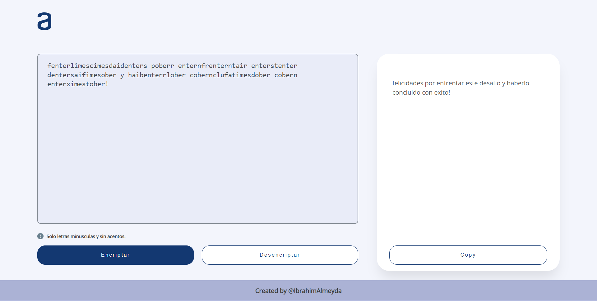

# Encryption Challenge - AluraLatam

Este proyecto es una aplicación web completamente responsive desarrollada con tecnologías web como HTML, CSS y JavaScript. Permite a los usuarios encriptar y desencriptar texto proporcionado por el usuario.

## Características

- Encriptación de texto: Los usuarios pueden ingresar texto y encriptarlo según un conjunto de reglas predefinidas.
- Desencriptación de texto: Los usuarios pueden ingresar texto encriptado y obtener la versión original desencriptada.
- Responsive: La aplicación se adapta a diferentes dispositivos y tamaños de pantalla, brindando una experiencia de usuario óptima en dispositivos móviles, tablets y computadoras de escritorio.

## Tecnologías Utilizadas

- HTML
- CSS
- JavaScript

## Demo

Puedes ver una demostración de la aplicación en acción [Encryptor-Challenge](https://ibrahim-003.github.io/encryption-challenge/).

## Capturas de Pantalla

